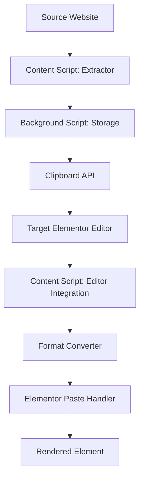
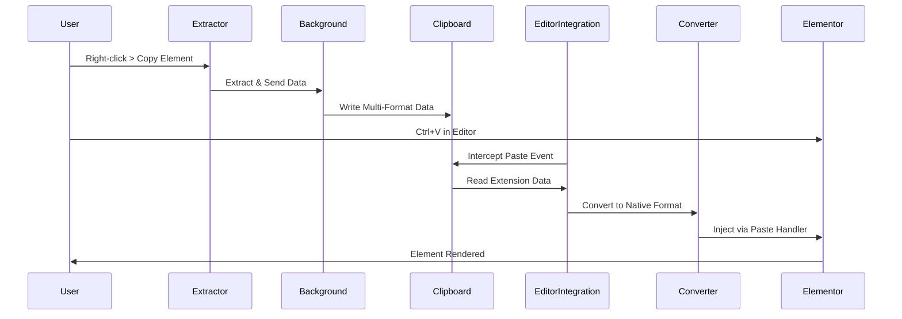

# Design Document: Native Elementor Paste

## Overview

The Native Elementor Paste feature transforms the Chrome extension into a standalone solution that eliminates the need for WordPress plugins. The design centers on intercepting Elementor's native clipboard operations and injecting properly formatted data that Elementor recognizes as if it came from its own copy operation.

**Key Design Principle:** Mimic Elementor's native behavior so precisely that the editor cannot distinguish between internally copied elements and externally extracted ones.

### Design Goals

1. **Zero Plugin Dependency**: Remove all WordPress plugin requirements except Elementor itself
2. **Seamless Integration**: Make paste operations feel native to Elementor's workflow
3. **Format Fidelity**: Preserve all element properties, styles, and settings
4. **Version Resilience**: Handle differences between Elementor versions gracefully
5. **Security First**: Sanitize external content while maintaining functionality

## Architecture

### High-Level Architecture



### Component Interaction Flow



### Architecture Layers

1. **Extraction Layer**: Parses Elementor data from source websites
2. **Storage Layer**: Manages clipboard data in multiple formats
3. **Detection Layer**: Identifies Elementor editor context
4. **Conversion Layer**: Transforms data to native Elementor format
5. **Injection Layer**: Integrates with Elementor's paste mechanism
6. **Feedback Layer**: Provides user notifications and error handling

## Components and Interfaces

### 1. Elementor Editor Detector

**Purpose**: Identify when the user is in an active Elementor editor session.

**Interface**:
```javascript
class ElementorEditorDetector {
  isElementorEditor(): boolean
  getElementorVersion(): string
  waitForElementorReady(): Promise<void>
  getEditorInstance(): ElementorEditor | null
}
```

**Implementation Strategy**:
- Check for `window.elementor` and `window.elementorFrontend` objects
- Verify editor mode by checking `elementor.config.document.id`
- Use MutationObserver to detect dynamic editor loading
- Poll with exponential backoff if Elementor loads asynchronously

**Design Decision**: Use multiple detection methods (object existence, DOM inspection, event listeners) to ensure reliability across different Elementor loading scenarios.

### 2. Paste Event Interceptor

**Purpose**: Capture paste operations before Elementor processes them.

**Interface**:
```javascript
class PasteInterceptor {
  initialize(): void
  interceptKeyboardPaste(event: KeyboardEvent): void
  interceptContextMenuPaste(event: MouseEvent): void
  interceptElementorPasteButton(): void
  shouldHandlePaste(): boolean
}
```

**Implementation Strategy**:
- Listen for `keydown` events (Ctrl+V, Cmd+V) on the editor iframe
- Hook into Elementor's context menu paste action
- Override Elementor's paste button click handler
- Check clipboard for extension marker before intercepting

**Design Decision**: Intercept at the event level rather than modifying Elementor's code to maintain compatibility and avoid breaking editor functionality.

### 3. Format Converter

**Purpose**: Transform extension data format to Elementor's native clipboard format.

**Interface**:
```javascript
class ElementorFormatConverter {
  convertToNativeFormat(extensionData: ExtensionData): ElementorClipboardData
  generateElementId(): string
  mapWidgetType(sourceType: string, version: string): string
  convertSettings(settings: object, widgetType: string): object
  validateOutput(data: ElementorClipboardData): boolean
}
```

**Data Structure Mapping**:

Extension Format → Elementor Native Format:
```javascript
// Extension Format
{
  type: "widget",
  widgetType: "heading",
  settings: { title: "Hello", tag: "h2" },
  content: "<h2>Hello</h2>"
}

// Elementor Native Format
{
  elType: "widget",
  widgetType: "heading",
  id: "a1b2c3d4",
  settings: {
    title: "Hello",
    header_size: "h2",
    _element_id: "",
    _css_classes: ""
  },
  elements: [],
  isInner: false
}
```

**Design Decision**: Maintain a version-specific mapping table for widget types and settings to handle Elementor's evolving schema. Pre-convert data during copy operation to reduce paste latency.

### 4. Clipboard Manager

**Purpose**: Handle multi-format clipboard operations compatible with Elementor.

**Interface**:
```javascript
class ClipboardManager {
  writeMultiFormat(data: object): Promise<void>
  readExtensionData(): Promise<object | null>
  hasExtensionData(): Promise<boolean>
  getElementorMimeType(): string
}
```

**Clipboard Format Strategy**:
- Primary: `text/plain` with JSON string (Elementor's default)
- Secondary: `application/json` with extension marker
- Tertiary: Custom MIME type for extension identification

**Design Decision**: Use multiple clipboard formats to ensure compatibility with Elementor's clipboard reader while maintaining extension-specific markers for detection.

### 5. Editor Context Injector

**Purpose**: Safely inject code into Elementor's editor context to access internal APIs.

**Interface**:
```javascript
class EditorContextInjector {
  injectScript(code: string): void
  accessElementorAPI(apiPath: string): any
  triggerElementorPaste(data: object): void
  setupMessageBridge(): void
}
```

**Injection Strategy**:
- Use `<script>` tag injection for main world access
- Establish message passing between content script and injected script
- Wrap all Elementor API calls in try-catch for safety
- Detect and adapt to Elementor's React component lifecycle

**Design Decision**: Inject minimal code into the main world to reduce security risks. Use message passing for data transfer between isolated contexts.

### 6. Version Compatibility Manager

**Purpose**: Handle differences between Elementor versions.

**Interface**:
```javascript
class VersionCompatibilityManager {
  detectVersion(): string
  getConversionRules(sourceVersion: string, targetVersion: string): ConversionRule[]
  applyConversionRules(data: object, rules: ConversionRule[]): object
  isCompatible(sourceVersion: string, targetVersion: string): boolean
}
```

**Compatibility Matrix**:
```javascript
const WIDGET_MIGRATIONS = {
  "2.x_to_3.x": {
    "image-box": "icon-box",
    "icon-list": "icon-list-item"
  },
  "3.x_to_4.x": {
    // Future migrations
  }
}

const SETTING_MIGRATIONS = {
  "heading": {
    "tag": "header_size"  // Old → New
  }
}
```

**Design Decision**: Maintain a migration matrix rather than version-specific converters to support multiple version jumps and reduce code duplication.

### 7. Media URL Handler

**Purpose**: Preserve external media URLs without requiring WordPress plugin.

**Interface**:
```javascript
class MediaURLHandler {
  extractMediaURLs(data: object): string[]
  convertToAbsoluteURLs(urls: string[], sourceOrigin: string): string[]
  validateURLs(urls: string[]): ValidationResult[]
  notifyExternalMedia(urls: string[]): void
}
```

**URL Handling Strategy**:
- Convert all relative URLs to absolute during extraction
- Preserve original URLs in Elementor's `url` and `background_image` settings
- Add metadata about external URLs for user notification
- Provide guidance on manual media upload if needed

**Design Decision**: Keep external URLs intact rather than attempting downloads, as this eliminates plugin dependency and respects source site bandwidth. Users can manually replace URLs if needed.

## Data Models

### Extension Data Model

```javascript
interface ExtensionData {
  version: string;              // Extension version
  elementorVersion: string;     // Source Elementor version
  timestamp: number;
  sourceURL: string;
  element: ElementData;
}

interface ElementData {
  elType: 'widget' | 'section' | 'column' | 'container';
  widgetType?: string;
  id: string;
  settings: Record<string, any>;
  elements: ElementData[];      // Nested elements
  isInner: boolean;
}
```

### Elementor Native Clipboard Model

```javascript
interface ElementorClipboardData {
  elType: string;
  widgetType?: string;
  id: string;
  settings: {
    [key: string]: any;
    _element_id?: string;
    _css_classes?: string;
  };
  elements: ElementorClipboardData[];
  isInner: boolean;
}
```

### Conversion Rule Model

```javascript
interface ConversionRule {
  type: 'widget_rename' | 'setting_rename' | 'setting_transform' | 'structure_change';
  sourcePattern: string | RegExp;
  targetPattern: string;
  transform?: (value: any) => any;
  condition?: (data: any) => boolean;
}
```

## Error Handling

### Error Categories

1. **Detection Errors**: Elementor editor not found or not ready
2. **Clipboard Errors**: Clipboard API unavailable or permission denied
3. **Conversion Errors**: Invalid data format or unsupported widget type
4. **Injection Errors**: Failed to access Elementor APIs
5. **Version Errors**: Incompatible Elementor versions

### Error Handling Strategy

```javascript
class ErrorHandler {
  handleError(error: Error, context: string): void {
    // Log to console for debugging
    console.error(`[Elementor Copier] ${context}:`, error);
    
    // Show user-friendly notification
    this.notifyUser(this.getUserMessage(error, context));
    
    // Fallback to safe state
    this.revertToSafeState(context);
    
    // Report to background for analytics (optional)
    this.reportError(error, context);
  }
  
  getUserMessage(error: Error, context: string): string;
  revertToSafeState(context: string): void;
}
```

**Design Decision**: Fail gracefully with informative messages rather than breaking the editor. Always provide a fallback path (e.g., manual paste instructions).

### Fallback Mechanisms

1. **Clipboard API Unavailable**: Use `document.execCommand('paste')` with event interception
2. **Elementor API Inaccessible**: Provide manual paste instructions with formatted JSON
3. **Conversion Failure**: Offer raw data download for manual import
4. **Version Incompatibility**: Attempt best-effort conversion with warnings

## Testing Strategy

### Unit Testing

**Components to Test**:
- Format Converter: Test all widget types and settings transformations
- Version Compatibility Manager: Test migration rules for known versions
- Media URL Handler: Test URL conversion and validation
- Clipboard Manager: Test multi-format read/write operations

**Testing Approach**:
```javascript
describe('ElementorFormatConverter', () => {
  it('should convert heading widget correctly', () => {
    const input = { /* extension format */ };
    const output = converter.convertToNativeFormat(input);
    expect(output.elType).toBe('widget');
    expect(output.widgetType).toBe('heading');
    expect(output.id).toMatch(/^[a-f0-9]{8}$/);
  });
  
  it('should handle nested sections', () => {
    // Test hierarchical structure preservation
  });
});
```

### Integration Testing

**Test Scenarios**:
1. Copy from external site → Paste into Elementor editor
2. Copy section with nested widgets → Verify hierarchy preserved
3. Copy element with media → Verify URLs maintained
4. Copy from Elementor 3.x → Paste into Elementor 4.x
5. Multiple paste operations → Verify unique IDs generated

**Testing Environment**:
- Local WordPress installation with Elementor
- Test pages with various widget types
- Multiple Elementor versions for compatibility testing

### Manual Testing Checklist

- [ ] Extension detects Elementor editor correctly
- [ ] Paste with Ctrl+V works in editor
- [ ] Paste with context menu works
- [ ] Paste button in Elementor toolbar works
- [ ] All widget types paste correctly
- [ ] Sections with columns paste correctly
- [ ] Nested elements maintain hierarchy
- [ ] Media URLs are preserved
- [ ] Undo/redo works after paste
- [ ] Notifications appear appropriately
- [ ] Error messages are clear and helpful

## Security Considerations

### Input Sanitization

**Sanitization Points**:
1. **HTML Content**: Strip `<script>`, `<iframe>`, event handlers
2. **URLs**: Validate against XSS patterns, ensure proper encoding
3. **Settings**: Validate data types, reject unexpected properties
4. **CSS**: Remove `javascript:` URLs, validate color/size values

**Sanitization Implementation**:
```javascript
class ContentSanitizer {
  sanitizeHTML(html: string): string {
    const temp = document.createElement('div');
    temp.innerHTML = html;
    
    // Remove dangerous elements
    temp.querySelectorAll('script, iframe, object, embed').forEach(el => el.remove());
    
    // Remove event handlers
    temp.querySelectorAll('*').forEach(el => {
      Array.from(el.attributes).forEach(attr => {
        if (attr.name.startsWith('on')) {
          el.removeAttribute(attr.name);
        }
      });
    });
    
    return temp.innerHTML;
  }
  
  sanitizeURL(url: string): string {
    if (url.startsWith('javascript:') || url.startsWith('data:')) {
      return '';
    }
    return url;
  }
}
```

### Content Security Policy Compliance

- Use `chrome.scripting.executeScript` for code injection
- Avoid inline scripts in injected content
- Use message passing instead of `eval()` or `Function()`
- Validate all data crossing security boundaries

### Permission Model

**Required Permissions**:
- `activeTab`: Access current tab for extraction
- `clipboardWrite`: Write to clipboard
- `clipboardRead`: Read from clipboard (optional, for detection)
- `scripting`: Inject content scripts

**Design Decision**: Request minimal permissions and explain each permission's purpose to users. Avoid broad host permissions.

## Performance Considerations

### Optimization Strategies

1. **Lazy Loading**: Only inject editor integration when Elementor is detected
2. **Pre-Conversion**: Convert data to native format during copy, not paste
3. **Caching**: Cache version compatibility rules and widget mappings
4. **Debouncing**: Debounce paste event handlers to prevent double-processing
5. **Async Operations**: Use async/await for clipboard and storage operations

### Performance Metrics

- **Detection Time**: < 100ms to detect Elementor editor
- **Conversion Time**: < 50ms to convert typical widget
- **Paste Latency**: < 200ms from Ctrl+V to element rendered
- **Memory Usage**: < 5MB for extension background page

### Resource Management

```javascript
class ResourceManager {
  private cache: Map<string, any> = new Map();
  private maxCacheSize: number = 100;
  
  getCached(key: string): any | null {
    return this.cache.get(key) || null;
  }
  
  setCached(key: string, value: any): void {
    if (this.cache.size >= this.maxCacheSize) {
      const firstKey = this.cache.keys().next().value;
      this.cache.delete(firstKey);
    }
    this.cache.set(key, value);
  }
}
```

## Deployment and Rollout

### Phased Rollout Strategy

**Phase 1: Beta Testing** (2 weeks)
- Release to small group of testers
- Collect feedback on compatibility issues
- Monitor error reports and edge cases

**Phase 2: Soft Launch** (1 week)
- Release to all users with feature flag
- Provide toggle to revert to plugin-based approach
- Gather performance metrics

**Phase 3: Full Release**
- Enable by default for all users
- Deprecate plugin-based approach
- Update documentation and tutorials

### Migration Path

For existing users with the WordPress plugin:
1. Detect if plugin is installed (via API check)
2. Show notification about new native paste feature
3. Provide option to disable plugin
4. Offer side-by-side comparison guide

### Rollback Plan

If critical issues are discovered:
1. Disable native paste via feature flag
2. Revert to plugin-based approach automatically
3. Collect detailed error logs
4. Fix issues and re-release

## Future Enhancements

### Potential Improvements

1. **Bi-directional Sync**: Copy from Elementor editor to external sites
2. **Style Preservation**: Better handling of custom CSS and global styles
3. **Template Support**: Copy entire page templates, not just elements
4. **Collaborative Features**: Share copied elements with team members
5. **AI-Powered Conversion**: Use ML to improve version compatibility
6. **Visual Diff**: Show preview of element before pasting

### Extensibility Points

- Plugin system for custom widget converters
- API for third-party integrations
- Webhook support for paste notifications
- Export/import clipboard history

## Appendix

### Elementor Data Structure Reference

**Widget Structure**:
```json
{
  "elType": "widget",
  "widgetType": "heading",
  "id": "a1b2c3d4",
  "settings": {
    "title": "My Heading",
    "header_size": "h2",
    "align": "center",
    "_element_id": "",
    "_css_classes": ""
  },
  "elements": [],
  "isInner": false
}
```

**Section Structure**:
```json
{
  "elType": "section",
  "id": "e5f6g7h8",
  "settings": {
    "layout": "boxed",
    "gap": "default"
  },
  "elements": [
    {
      "elType": "column",
      "id": "i9j0k1l2",
      "settings": {
        "_column_size": 50
      },
      "elements": [/* widgets */],
      "isInner": false
    }
  ],
  "isInner": false
}
```

### Version Compatibility Notes

**Elementor 3.0 → 3.5**:
- Widget type names remain stable
- New responsive settings added (mobile, tablet)
- Global colors and fonts introduced

**Elementor 3.5 → 4.0**:
- Container element introduced (replaces sections in some cases)
- Flexbox layout options added
- Some widget settings restructured

### Glossary

- **elType**: Element type (widget, section, column, container)
- **widgetType**: Specific widget identifier (heading, button, image, etc.)
- **isInner**: Whether element is inside an inner section
- **settings**: Key-value pairs for element configuration
- **elements**: Array of child elements (for containers)
